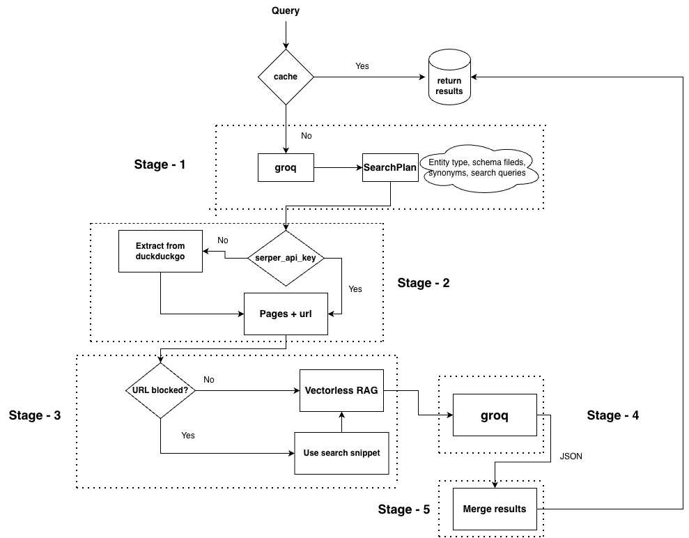

# 🕸️ Agentic Search ⚡

[](https://www.python.org/downloads/)
[](https://fastapi.tiangolo.com/)
[](https://github.com/facebookresearch/faiss)
[](https://groq.com/)

> Autonomous web research that turns any topic query into a structured, source-traced table of entities.

## What it does

Agentic Search takes a free-text topic like `"AI startups in healthcare"` or `"open source database tools"` and autonomously plans a search strategy, scrapes the web, and extracts structured entity data — returning a table where every cell value is traced back to its exact source URL and snippet.

It runs as a 5-stage pipeline entirely on free-tier APIs. No OpenAI, no paid infrastructure.

## Live Demo

[**→ Video Walkthrough**](https://www.youtube.com/watch?v=ckm78iBGMMY)

Each cell shows the extracted value and the exact source it came from, fields that couldn't be confirmed from the scraped content are left blank rather than hallucinated.

## Evaluation Criteria

| Criterion | Where it's addressed |
|---|---|
| **Output quality** | Vectorless RAG routing, JSON-LD extraction, Llama 3.3 70b, per-cell source tracing, semantic dedup |
| **Design choices** | Every decision documented in [What we tried and dropped](#what-we-tried-and-dropped) |
| **Code structure** | 5-stage pipeline, one module per stage, Pydantic models throughout, constants at top of each file |
| **Documentation** | This README — setup, architecture, every challenge and resolution |
| **Complexity** | FAISS semantic cache, Vectorless RAG, SSE streaming, section chunking, batch LLM extraction, entity detail UI |

## Architecture



The pipeline has 5 stages. Each stage is a separate module with a single responsibility.

### Stage 1 — Query Planner (`pipeline/planner.py`)
The planner is the brain of the system. Given a raw topic query, it uses Llama 3.3 70b to infer what kind of entities we're looking for, define the schema (which fields to extract), generate field synonyms for the RAG router, and produce 4 diverse search queries. The reason this is LLM-driven rather than rule-based is that the entity type and relevant schema fields are completely different for "AI startups" vs "pizza restaurants" vs "database tools" — a static schema would produce garbage results.

### Stage 2 — Web Search (`pipeline/search.py`)
Runs all 4 planner-generated queries in parallel against Serper.dev (Google results) and deduplicates the URLs. If no Serper key is set, falls back to scraping DuckDuckGo's HTML endpoint — no API key required. The reason we generate 4 queries instead of 1 is coverage: list articles, directories, news, and comparisons each surface different entities.

### Stage 3 — Async Scraper + Vectorless RAG (`pipeline/scraper.py`)
Fetches up to 20 pages in parallel. Extracts JSON-LD structured data and meta tags first — before tag stripping, since both live inside tags that get removed during cleaning. Strips boilerplate, then splits the body into named sections using h1/h2/h3 headers as natural dividers. Blocked domains (Yelp, TripAdvisor, Facebook) fall back to the search snippet.

The section splitting is the chunking step of Vectorless RAG — covered in detail in [Technical Decisions](#technical-decisions). Each `ScrapedPage` stores the flat content, the structure map (section ID → header name), and the chunks dict (section ID → text), all three of which are consumed by Stage 4.

### Stage 4 — Entity Extractor (`pipeline/extractor.py`)
The keyword router scores each page's sections by how many schema field keywords and synonyms appear in the text, picks the top 3 sections per page, and assembles one combined prompt across all pages. This goes to Llama 3.3 70b in a single LLM call. Every extracted value is tagged with the source URL and the exact snippet that justified it.

### Stage 5 — Pure Python Merger (`pipeline/merger.py`)
Groups duplicate entities by fuzzy name matching (substring and prefix), then merges each group into one record by picking the longest non-null value per field. No LLM call — deterministic and instantaneous. Results are sorted by confidence and filtered to drop entities where more than 60% of fields are null.

### Semantic Cache (`cache.py`)
Before Stage 1 runs, the query is embedded with `all-MiniLM-L6-v2` and compared against previously cached queries in a FAISS index. A cosine similarity above 0.85 triggers a cache hit and returns the stored result instantly. The index and result store are persisted to disk so the cache survives server restarts.

## Technical Decisions

### Vectorless RAG
Standard RAG embeds chunks into vectors, embeds the query, and retrieves by cosine similarity. We skip the embedding step and replace it with keyword scoring, each section is scored by counting how many schema field keywords and their synonyms appear in the text. Top 3 sections per page go to the extractor.

The tradeoff is deliberate. For this use case the signal is strong enough without embeddings, a section titled "Licensing" will score high for the `license` field without needing a vector to figure that out. The gap where keyword matching fails (a section called "Tech Stack" not matching `programming_language`) is closed by the planner generating `field_synonyms` at Stage 1. Zero embedding model, zero extra latency, zero extra tokens.

### Batch Extraction
Instead of running one LLM call per page, 12 pages meant 12 calls, 12x the rate limit exposure, and sequential waits on 429s, the alternate step sends all pages in a single prompt with each page's relevant chunks concatenated. One call, one response, all entities across all pages returned together. This was the single biggest reliability improvement in the project.

### Pure Python Merger
Instead of using an an LLM a pure python merger was used to intelligently pick the best value per field when merging duplicates. Fuzzy name grouping by substring matching, best value selected as the longest non-null string were some of its functions. Saved 10-16k tokens per query and made Stage 5 instantaneous. The LLM would do the work that a simple heuristic handles well enough for this use case.

### FAISS Semantic Cache
Exact-match caching would miss `"AI startups in healthcare"` vs `"healthcare AI companies"` — same intent, different string. The cache embeds every query with `all-MiniLM-L6-v2` and stores it in a FAISS index. On each new query, cosine similarity is checked against all cached queries, a score above 0.85 returns the cached result instantly. The index is persisted to disk so it survives restarts.

### SSE Streaming
The pipeline takes 20-40 seconds end to end. Returning a single JSON response at the end would leave the user staring at a blank screen. Server-Sent Events let the backend push stage updates to the frontend as they happen, the user sees each stage complete in real time, the search plan appears as soon as Stage 1 finishes, and results render the moment Stage 5 is done.

### Dual Search Backend
Serper.dev provides Google results via API (2,500 free searches on signup). DuckDuckGo's HTML endpoint requires no API key at all, the scraper hits `html.duckduckgo.com/html/` directly and parses the results page. If `SERPER_API_KEY` is not set, the system falls back to DuckDuckGo automatically with no code changes required.

## What was Tried and Dropped

### LLM Providers

| Provider | What happened |
|---|---|
| Anthropic API | Billing limits hit immediately during development |
| Gemini 1.5 Flash | Poor structured JSON extraction quality |
| Gemini 2.0 Flash | SDK unreliable, direct REST API also flaky |
| Cerebras | 404 on first attempt (wrong model name), abandoned |
| SambaNova | 401 — API key variable name mismatch, abandoned |
| Groq Llama 3.1 8b | 5x cheaper but JSON output quality was unusable |
| **Groq Llama 3.3 70b** | Best quality, manageable token usage — final choice |

### Search Providers

| Provider | What happened |
|---|---|
| Brave Search API | Marketed as free, actually requires payment |
| **Serper.dev** | 2,500 free Google searches on signup — primary |
| **DuckDuckGo HTML** | Zero API key, scrapes HTML endpoint — fallback |

### LLM Merger → Pure Python
The original Stage 5 used Llama 3.3 70b to intelligently merge duplicate entities, the LLM would read all candidate records and pick the best value per field. It worked well but the merge prompts were large, responses hit token limits mid-JSON producing broken output, and it consumed 10-16k tokens per query. Replaced with pure Python substring grouping and longest-value selection. Zero tokens, instantaneous, good enough.

### Per-Page Extraction → Batch
Originally ran one LLM call per page with a semaphore limiting concurrency. Hit Groq's 6,000 TPM limit constantly, required retry logic with 30-60 second waits, and made the pipeline feel broken. Collapsed into a single batched call across all pages — one prompt, all chunks, one response.

### Gap Filling
After merging, null-heavy entities (>50% null fields) triggered a second search pass with targeted queries like `"ClickHouse database tool license programming_language"`. In practice these queries were too literal — search engines don't return useful structured data from field name strings. Added 25-30 seconds, rarely improved results. Removed entirely.

### Critic Agent
Built a Stage 6 critic that checked extracted values against source snippets for hallucinations, scored entity relevance against the original query, and adjusted confidence scores. It worked correctly but added 15-20 seconds to every query. Attempted to make it non-blocking (send results first, update table when critique finishes) but the complexity wasn't worth it for a demo. Removed. Documented as a future improvement.

### LLM Router for Vectorless RAG
The first version of the RAG router used Llama 3.1 8b to read a table of contents and pick relevant sections, one LLM call per page. For 8 pages that was 8 extra calls before the main extraction call. Replaced with keyword scoring in pure Python. Same outcome, zero tokens.

## Setup

### Prerequisites
- Python 3.11+
- Groq API key → [console.groq.com](https://console.groq.com) — free, no credit card
- Serper API key → [serper.dev](https://serper.dev) — 2,500 free searches, no credit card
  - Optional — leave blank to use DuckDuckGo

### Install
```bash
git clone https://github.com/shaun270/Agentic-search.git
cd Agentic-search

python -m venv venv
source venv/bin/activate   # Windows: venv\Scripts\activate

pip install -r backend/requirements.txt
```

### Configure
```bash
cp .env.example .env
```

`.env`:
```
GROQ_API_KEY=gsk_...
SERPER_API_KEY=...    # optional
```

### Run
```bash
python run.py
# → http://localhost:8000
```

## Known Limitations

- **JS-rendered pages** — plain HTTP fetch only, no headless browser. React and SPA pages return minimal or empty content. Crunchbase and LinkedIn are effectively unusable.
- **Paywalled content** — falls back to the search snippet (~150 chars). Enough for the entity name, rarely enough for full attribute extraction.
- **Groq 100k TPD** — the free tier resets daily. Heavy testing can exhaust it. Workaround for development: create a second free Groq account.
- **5-15 entities typical** — the batch prompt fits 8 pages × 800 chars. Broader queries that need more coverage hit token limits before getting there.
- **Name disambiguation** — the fuzzy merger can over-merge (`"Redis"` and `"Redis Enterprise"` become one entity) or under-merge (`"ChatGPT"` and `"GPT-4"` stay separate).
- **Synonym quality** — the planner generates synonyms but their quality varies by query type. Abstract entity types produce weaker synonyms than concrete ones.
- **Cache threshold** — 0.85 cosine similarity is conservative. Very similar queries with different intent may hit the cache and return stale results.


## 📂 Code Structure

```text
agentic-search/
├── backend/
│   ├── cache.py       # FAISS Semantic Memory engine
│   ├── main.py        # FastAPI server & SSE orchestrator
│   ├── models.py      # Pydantic schemas (FinalTable, Entity, etc.)
│   └── pipeline/
│       ├── planner.py # Stage 1: Schema Generation
│       ├── search.py  # Stage 2: Serper / DuckDuckGo routing
│       ├── scraper.py # Stage 3: Async Fetch & HTML Parsing
│       ├── extractor.py # Stage 4: Vectorless RAG & JSON Extraction
│       └── merger.py  # Stage 5: Deduplication heuristics
├── frontend/
│   └── index.html     # Vanilla JS/CSS streaming interface
```

## Future Improvements

- **Critic agent** — was built and works, removed only for latency reasons. Would add back as a truly async background task that updates the table after results are already shown.
- **Embedding-based router** — replace keyword scoring in the RAG router with local sentence-transformer embeddings. Would catch synonym misses like "Tech Stack" → `programming_language` without needing the planner to generate synonyms explicitly.
- **Playwright scraping** — headless browser for JS-rendered pages. Would unlock Crunchbase, LinkedIn, and most modern SPA sites that currently return empty content.
- **Smarter merger** — confidence-weighted value selection instead of longest-string. A short precise value from an official source should beat a long vague one from a blog.
- **Streaming extraction** — yield entities to the frontend as they are extracted rather than waiting for the full batch response. Would make the pipeline feel significantly faster.
- **Query refinement** — after results load, suggest follow-up queries based on what fields came back mostly null.
